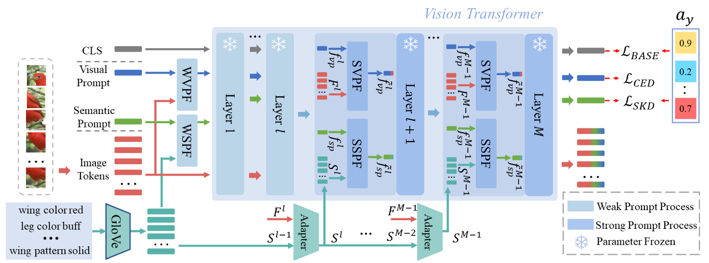

## Introduction
Visual and Semantic Prompt Collaboration for Generalized Zero-Shot Learning.
This project is a basic implementation of VSPCN by pytorch platform.

## Architecture

## Requirements

1. Python 3.6

2. Pytorch 1.7.0

## Implementations

python main.py

## Datasets Prepare

1. Dataset: please download the dataset (CUB, AWA2, SUN) to your machine and set the path correspondingly.

2. Attribute w2v: the attribute w2v is in w2v file and the processing procedure refers to PSVMA.

